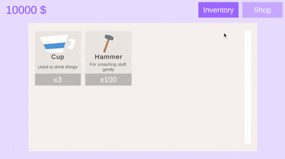

**🎥 For a complete walkthrough and technical deep-dive, watch the full presentation:**

# CONTEXT 

This project is a functional **Shop + Inventory System** built in Unity as a technical interview exercise. Developed within a self-imposed 4-hour constraint, it demonstrates clean architecture principles while maintaining pragmatic trade-offs suitable for rapid prototyping.

**Key Features:**J
- **Data-driven design** using ScriptableObjects for items, shops, and inventories
- **Modular architecture** with clean separation between UI, logic, and data
- **Extensible system** supporting multiple shop types with individual pricing
- **Event-driven communication** ensuring loose coupling between components
- **Responsive UI** with smooth navigation and user feedback

**Technical Approach:**
The system balances code quality with development speed. Core components follow clean principles (dependency inversion, single responsibility), while prototype-specific code prioritizes functionality over perfect architecture. The result is a maintainable foundation that could scale to production requirements.

**Key Patterns:** Event-driven architecture, ScriptableObject data containers, Dependency injection

# Assignment brief

### 🎮 Overview

Create a small Shop + Inventory System in Unity.

The player should be able to:

- View a list of items available for purchase (with name, icon, description, and price)
- Purchase an item
- View the items collected in their personal inventory

---

### 📦 Requirements

- The shop items must be easy to configure and reusable
- The system should be structured in a way that allows different item types or behaviors to be added in the future
- The UI must be clear, functional, and visually pleasant (not necessarily artistic, but well-organized)
- There should be a basic logic to switch between different game states or views (e.g., Shop / Inventory / Purchase feedback)

---

### 🧠 What We're Evaluating

| **Skill** | **What We Look For** |
| --- | --- |
| Project structure | Clear separation between logic, data, and presentation |
| Scalability and flexibility | Can new item types or logic be easily added? |
| UI and visual design | Is the UI intuitive, visually organized, and readable? |
| Code architecture | Clean, modular design showing understanding of states, data-driven logic, etc. |
| Version Control | Demonstrates ability to structure commits, write clear messages, and use GitHub professionally |
| Polish and finish | Does it feel complete? Are there signs of testing, iteration, and care? |

---

### ⏱️ Estimated Duration

This challenge is designed to be completed in 1–2 days of work.

Focus on delivering something functional, polished, and well-structured, even if simple.

---

### 📹 Submission

To complete the challenge, you must record a short video where you:

- Walk through the project
- Explain the key scripts and systems
- Show the game running in the Unity Editor or build

Then send:

- A link to the video (YouTube, Loom, or Google Drive)
- A GitHub/GitLab repo.
